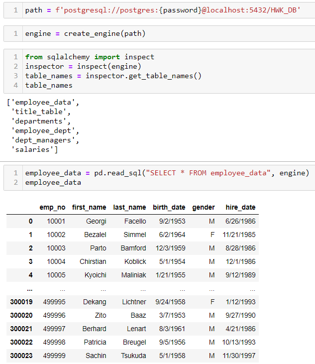
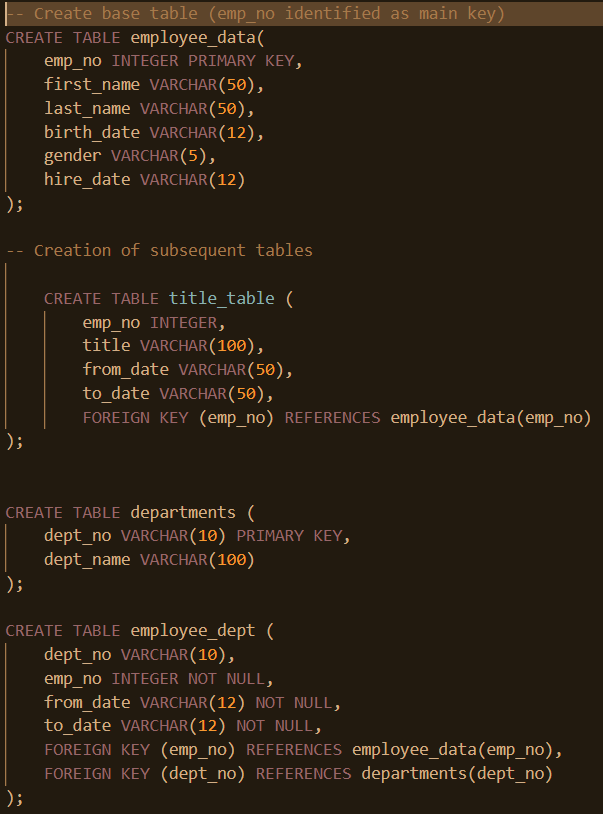
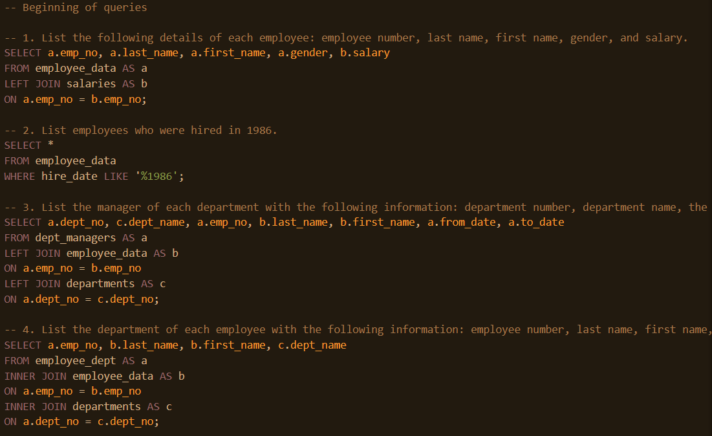
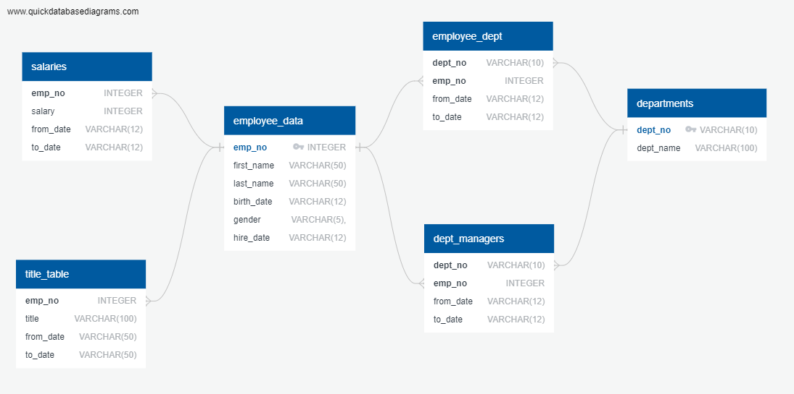

# SQL Database / Company data storing and querying

## By Erick Hernandez

In this project I had to create a database using Postgresql which contained several fields for an employee record. I created a connection with an engine to DB admin in order to further explore the data.

The process involved:

Data identification and analysis, classification into tables regarding the nature of the records.

Then it comes the creation of Primary Keys in order to vinculate the tables between them. Querying to insure data integrity and performing of desired data can now be carried out.

Finally, a visualization with https://www.quickdatabasediagrams.com/ for final recognition was made.

---